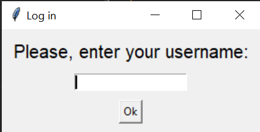
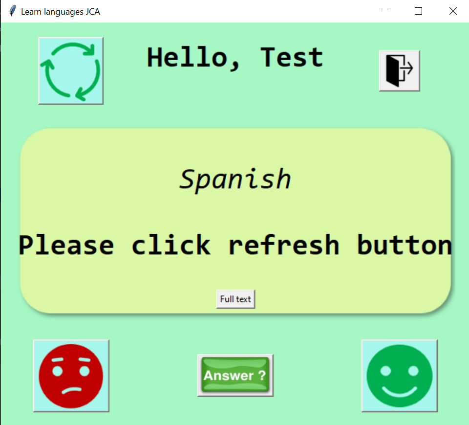
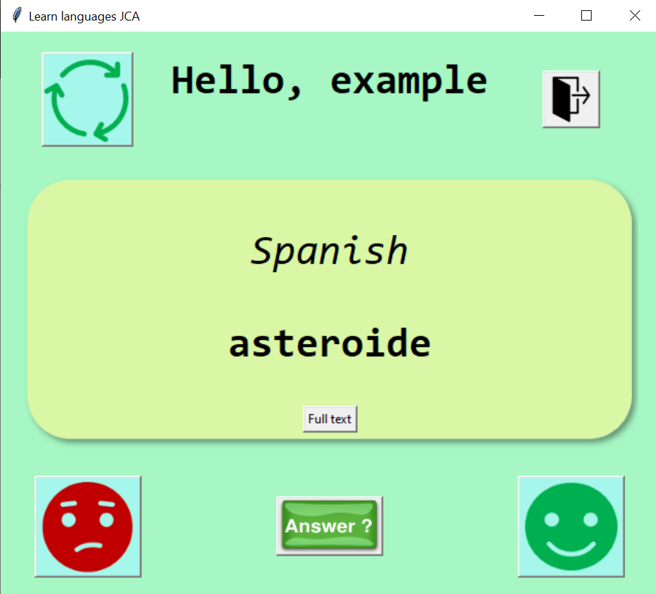
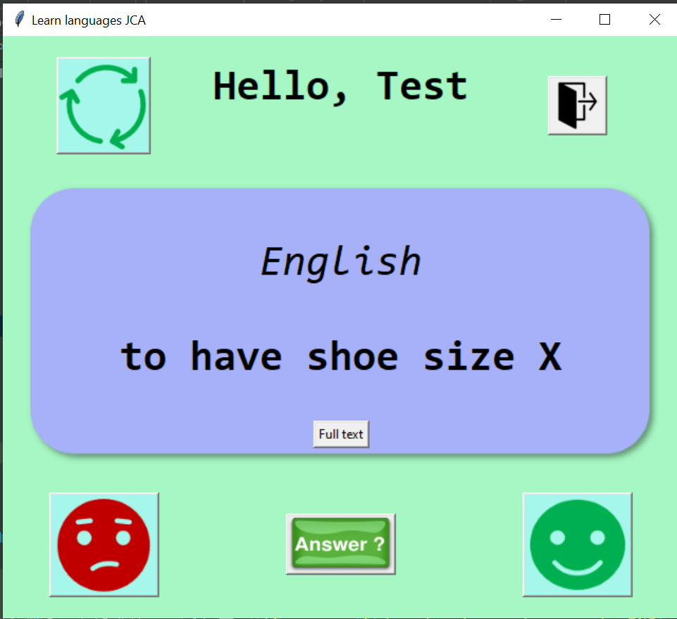

# Flash Cards Spanish-English
This program may help you in your path to learn spanish.  
Note that your user will be used to save your already-known words and the ones to be learnt.

## Instructions
- Create a Fork of the repository (you can access all projects).
- Open your favourite IDE (I use [PyCharm](https://www.jetbrains.com/pycharm/)).
- Check the ***[requirements.txt](https://github.com/JuanCarcedo/jca-python-projects/blob/main/requirements.txt)*** file.  
  - For this project you will need:
    + tkinter.

### Note: 
All data is saved in CSV files. Feel free to view them in:  
- ```/data/yourUser_es_en.csv``` to check all words.
- ```/data/yourUser_es_en_correct.csv``` to check the ones you did guess right.  

Please do not modify the names of these files.

## How to use
1) Run the file ```main.py```.
2) Log in into the system. If your user does not exist, the program will create it.
3) Click the refresh button to start the game.
4) Click "Full text" if you cannot see the full word (or definition).
5) To know if you guessed right, click "Answer".
6) Select "Happy face" if you were right, "Sad face" if not.
   - Do not cheat!
7) Whenever you want to exit please click the door button.  
Enjoy!

## Example of output
Log in page:  


Main page:  


Word to guess:


Answer:


## Author and Licence
**[Juan Carcedo](https://github.com/JuanCarcedo)**  
2022 Copyright © - Licence [MIT](https://github.com/JuanCarcedo/jca-python-projects/blob/main/LICENSE.txt)