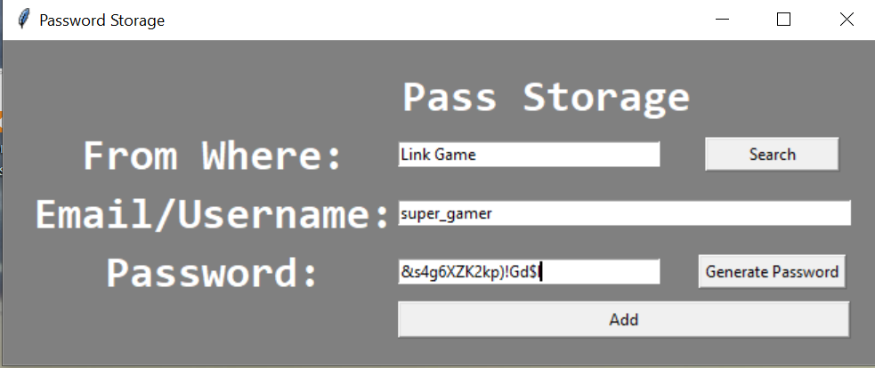
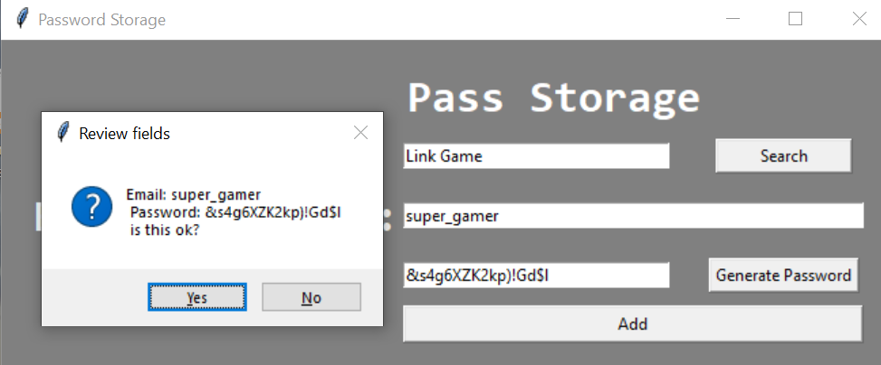
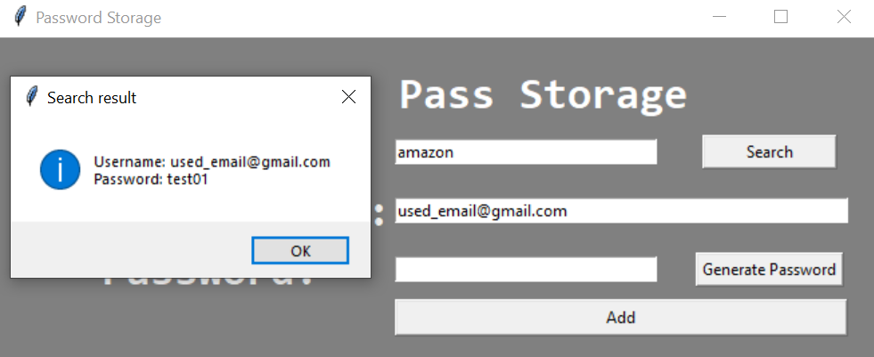

# Password Generator
I created this program because I was tired of thinking where did I put my notes with passwords.  
I am not good at all to remember 100 passwords from different websites so, this program helped me a lot.    
_This program can:_  
+ Suggest a strong password for you.  
  + It will be copied into your clipboard when you generate it.
+ Save in your machine your passwords (offline).

## Instructions
- Create a Fork of the repository (you can access all projects).
- Open your favourite IDE (I use [PyCharm](https://www.jetbrains.com/pycharm/)).
- Check the ***[requirements.txt](https://github.com/JuanCarcedo/jca-python-projects/blob/main/requirements.txt)*** file.  
  - For this project you will need:
    + tkinter.

Note:  
- You can find your passwords stored in a json file.
- If you have issues reading a json, there are tons of free "beautiful printers" online.
  - Although this kills the purpose of keeping your passwords offline...

## How to use
1) Run the file ```main.py```.
2) _used_email@gmail.com_ used as default/dummy email. Please change it.
3) Write the website (or program) from where you want to save your password.
   - To check/retrieve information, click ```Search```. Note that your password will be copied into your clipboard, you can use it easily.  
4) Input your email/username and the password you want to use.  
   - If you click ```Generate Password```, the system will suggest a password.
   - Sometimes this will generate a ```Click again``` message. This is to prevent a rare issue. If you see it, click again.
5) Click ```Add``` to store the data into a json file.

As I said, passwords are stored in the local machine.

## Example of output
Landing page:  

  
New Password:  
Note suggestion of password.  


Add password:  


Search password:  
Note, you only need to use From Where field to retrieve the user and password.  


## Author and Licence
**[Juan Carcedo](https://github.com/JuanCarcedo)**  
2022 Copyright © - Licence [MIT](https://github.com/JuanCarcedo/jca-python-projects/blob/main/LICENSE.txt)
