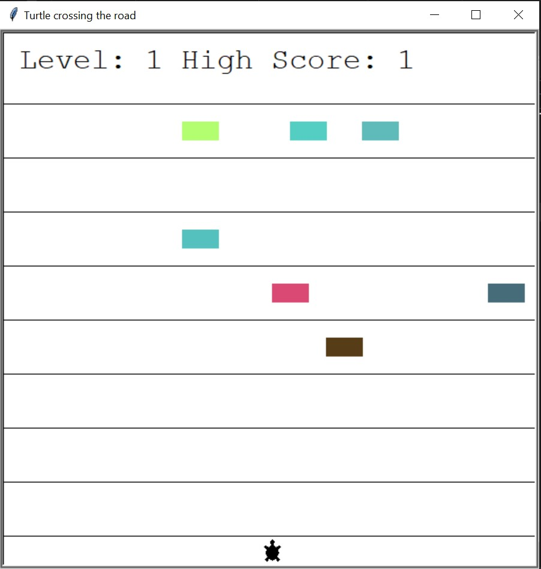
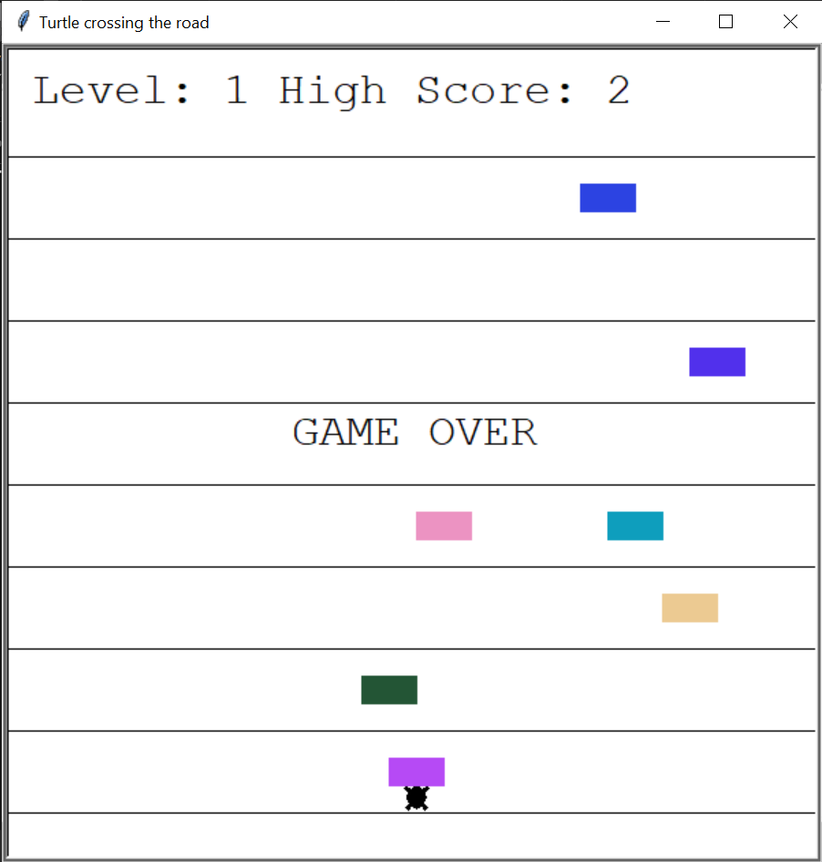

# Cross the road with the Turtle
This is the first game I created. Later on I also did a snake and tried to develop something in PyGame following a tutorial.  
The goal of this game is to make the Turtle cross safely the road.  
All colored blocks are cars, you touch one, you lose.

## Instructions
- Create a Fork of the repository (you can access all projects).
- Open your favourite IDE (I use [PyCharm](https://www.jetbrains.com/pycharm/)).
- Check the ***[requirements.txt](https://github.com/JuanCarcedo/jca-python-projects/blob/main/requirements.txt)*** file.  
  - For this project you will need:
    + tkinter.
    + turtle.

Note:  
- Each level increases the speed of the cars.
- Your last high score will be stored and loaded every time you play.
  - File ```high_score_data.txt```.

## How to use
1) Run the file ```main.py```.
2) Press the up arrow to move the turtle.  
3) Reach the other side of the road to level up.

You cannot move backwards!  
This game does not have an ending; the poor turtle is inside an endless Groundhog day.

## Example of output
Game screen:  
Horizontal lines are lanes.


Game Over:  


## Author and Licence
**[Juan Carcedo](https://github.com/JuanCarcedo)**  
2022 Copyright © - Licence [MIT](https://github.com/JuanCarcedo/jca-python-projects/blob/main/LICENSE.txt)
